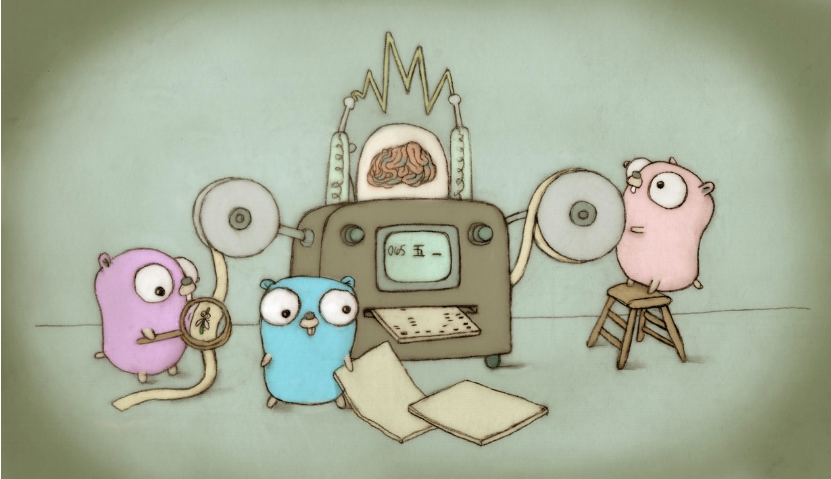

<!-- #region -->
# <a id='7'>Introduction-to-Go</a>

# Author : [Joshua Owusu Ankomah](https://www.linkedin.com/in/joshua-owusu-ankomah-2b5a9898/)
 
 

<a href="https://github.com/code-JOA/Introduction-to-Go/actions"></a>




# Resources
### Installing GO
https://go.dev/doc/install
<!-- #endregion -->

### Getting Started
https://go.dev/doc/tutorial/getting-started

### Managing dependencies
https://go.dev/doc/modules/managing-dependencies#naming_module


<!-- #region -->
### Lesson Guide

## [Session 1: Introduction to Golang ](#Intro)


#### [Part 1: Baiscs](#why_go)
- [Hello world](#why_py)


#### [Part 2: Variables](#02.variables)
- [variables](#01variables.go)
- [take2inputs](#02takeInput2.go)
- [year-of-birth](#YearOfBirth.go)


#### [Part 3: Conditionals](#conditionals)
- [conditionals](#conditionals.go)
- [if-else-statement](#if_else.go)
- [if-else-statement2](#if_else2.go)
- [rating_exercise](#rating_exercise.go)


#### [Part 3b: LOOPs](#Loops)
- [Basics](#basics)
- [Advance](#Advance)


#### [Part 4: Points And Arrayys ](#pointers)
- [Pointers](#Pointers)
- [Arrays](#Arrays)


#### [Part 6: More](#More)

#### [Part 7: More](#More)
<!-- #endregion -->

```python

```
